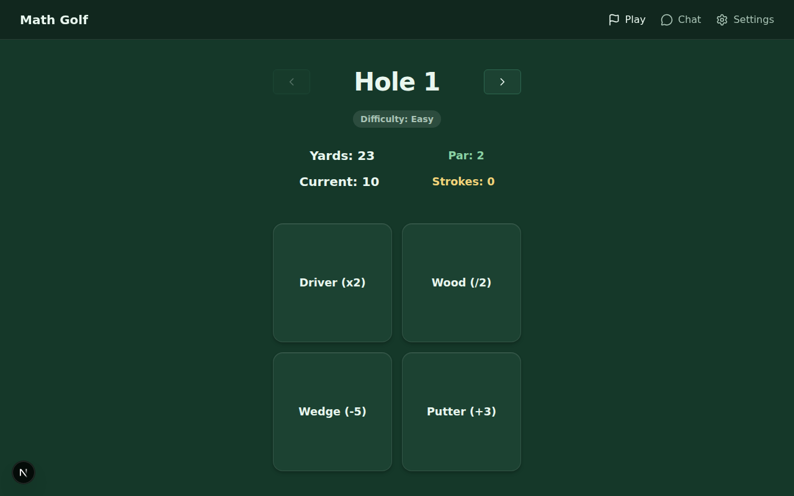

# Math Golf

A puzzle game that turns mental math into a round of golf. Every hole gives you a number and a target — pick the right "clubs" (math operations) to land exactly on the target in par strokes or fewer.

**Play it live:** [mathgolfgame.vercel.app](https://mathgolfgame.vercel.app)

[](https://mathgolfgame.vercel.app)
[](LICENSE)
[](https://nextjs.org)
[](https://claude.com/claude-code)



## Why Math Golf?

Golf scoring is a great fit for math puzzles: there's a target, a stroke budget, and the satisfaction of sinking it under par. Each club applies a fixed operation, so every hole becomes a tiny equation-search problem — can you see the path from 38 to 147 in five moves? Easy holes teach the club mechanics in two strokes; expert holes need six-stroke chains where one wrong club puts the target out of reach.

## Quick Start

```bash
git clone https://github.com/nexuslabsx/math-golf-game
cd math-golf-game
pnpm install
pnpm dev
```

Open [http://localhost:3000](http://localhost:3000) and hit **Let's Play**. Production build is `pnpm build`.

## How to Play

Each hole shows the target (**Yards**), your stroke budget (**Par**), and your current number (**Current**). Tap a club to apply its operation — each tap costs one stroke:

| Club | Operation |
| --- | --- |
| Driver | ×2 |
| Wood | ÷2 (rounded down) |
| Wedge | −5 |
| Putter | +3 |

Land exactly on the target at or under par to win the hole. The stroke counter stays yellow while you play, turns green when you sink it at or under par, and red once you've blown past par — at which point you can retry the hole or reveal the solution sequence.

There are **10 hand-crafted holes** across four difficulty tiers:

| Difficulty | Holes | Par |
| --- | --- | --- |
| Easy | 3 | 2 |
| Medium | 2 | 3 |
| Hard | 2 | 4 |
| Expert | 3 | 5–6 |

## Features

- **10 holes, 4 clubs:** Difficulty ramps from two-stroke warmups to six-stroke expert chains, with prev/next navigation and a difficulty badge on every hole
- **Color-coded scoring:** Live stroke feedback (in progress / under par / over par), with par and under-par celebration messages
- **Retry & reveal:** Going over par offers an instant retry plus an optional step-by-step solution for the hole
- **3 visual themes:** Dark Forest, Cyber Night, and Midnight Neon, persisted across visits via `next-themes`
- **Responsive layout:** Fixed top navbar on desktop, native-feeling bottom tab bar on mobile
- **Dedicated pages:** Landing (`/`), game (`/play`), settings (`/settings`), and a chat page (`/chat`) reserved for upcoming AI features

## Architecture

- **Next.js 16** (App Router, Turbopack) with **React 19** and **TypeScript 5**
- **Tailwind CSS 4** for styling; themes implemented as CSS custom properties switched by `next-themes` class attribute
- Game logic lives in a single custom hook ([`app/play/hook.ts`](app/play/hook.ts)); pages stay presentational
- Hole and club data are plain typed constants ([`lib/constants.ts`](lib/constants.ts), [`lib/types.ts`](lib/types.ts)) — clubs are just `(x: number) => number` formulas, so adding clubs or holes is a data change, not a code change
- Icons from `lucide-react`, package management with `pnpm`, deployed on Vercel

## How it was built

The game started as a CodeSandbox prototype and was migrated into this Next.js app, then developed spec-first with AI agents:

- [`SPEC.md`](SPEC.md) is the living roadmap — active work, phases, and backlog
- [`AGENTS.md`](AGENTS.md) is the source of truth for architecture patterns and coding standards that AI agents follow
- [`docs/`](docs/) holds design specs for major features (e.g., the mobile navigation system)

Completed roadmap items graduate from `SPEC.md` into the feature list above. Most of the implementation was done with [Claude Code](https://claude.com/claude-code); the checked-in [`.claude/settings.json`](.claude/settings.json) makes builds work out of the box in Claude Code cloud sessions.

## Development

```
/app                  # App Router pages (landing, play, chat, settings)
  /play/hook.ts       # Game state & scoring logic
/components           # ThemeSelector + responsive layout (navbar, tab bar)
/lib                  # Types, game data (clubs & holes), helpers
/docs                 # Feature specs and screenshots
```

- `pnpm dev` — run locally with hot reload
- `pnpm build` — production build
- `pnpm lint` — ESLint

## Roadmap

Next up (see [`SPEC.md`](SPEC.md) for the full list): hole timers with personal records, progress persistence, course sequences with summary scoring, and AI features built on the Vercel AI SDK — a snarky commentary bot, an AI caddy that suggests moves, and a course architect that generates custom holes.

## Credits

Made by [Monte Thakkar](https://x.com/montethakkar), built with [Claude Code](https://claude.com/claude-code).

## License

[MIT](LICENSE) © Monte Thakkar
